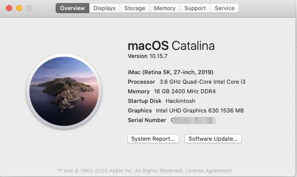

## Hackintosh Catalina Guide for Gigabyte B360M-D3H(OpenCore)

I used [this guide](https://dortania.github.io/OpenCore-Desktop-Guide/) as a starting point.

### Software

- [OpenCore 0.6.1][https://github.com/acidanthera/opencorepkg/releases/]
- Clover Configurator
- [ProperTree](https://github.com/corpnewt/ProperTree) or [PlistEditPro](https://www.fatcatsoftware.com/plisteditpro/): Universal plist editor
- [GenSMBIOS](https://github.com/corpnewt/GenSMBIOS): For generating our SMBIOS data

### Hardware

See my [Hardware List](HARDWARE.md)

### What's Working/What's Not

#### Working

- Ethernet
- Onboard Audio (including digital audio)
- APFS
- Sleep/Wake
- All USB ports at 3.x speed
- App Store
- APFS
- Handoff
- Bluetooth & Wi-Fi (via Broadcom adapter)
- Power Nap
- NVRAM

#### Not Working (as expected)

- Built-in WIFI. This will very likely never work since it is the new Intel CNVi that macOS doesn't support.
- Onboard Bluetooth. I disabled it (HS14) because I have a natively supported Broadcom BCM94360CS2 WIFI/BT adapter anyways.

#### Not Yet Tested

- FileVault
- iMessage
- Unlock with Apple Watch
- Airdrop
- AirPlay
- Facetime

### Step By Step Instructions

I literally just followed the [OpenCore Desktop Guide](https://dortania.github.io/OpenCore-Install-Guide/config.plist/coffee-lake.html/). When in doubt, just look at my KEXTs, drivers and config.list for guidance.

### My EFI

You are welcome to use my EFI folder. However, make sure you set the following with [GenSMBIOS](https://github.com/corpnewt/GenSMBIOS):

- SystemSerialNumber
- SystemUUID
- MLB
